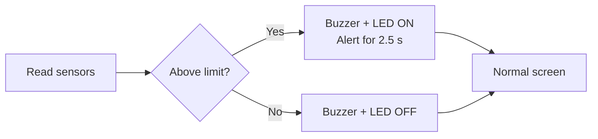
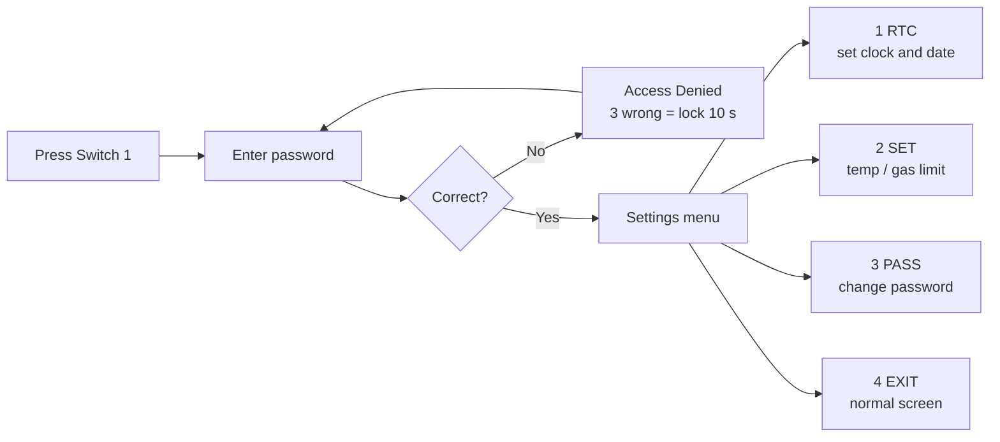
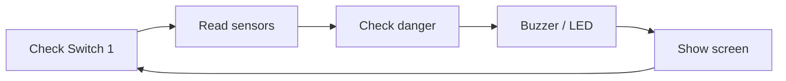

# Kitchen Safety Monitor: Temperature and Gas Alarm (LPC2148)

A keypad-protected safety monitor for the kitchen, built around the **LPC2148 (ARM7)**. It watches temperature and gas concentration, displays them next to a live clock, and sounds a buzzer with an LED the moment either one crosses its limit.

-blue?style=for-the-badge)


<p align="center">
  
  <br/>
  <sub><i>System block diagram</i></sub>
</p>

---

## Contents

- [About the Project](#about-the-project)
- [Components](#components)
- [Wiring](#wiring)
- [Tools and Drivers](#tools-and-drivers)
- [Repository Layout](#repository-layout)
- [Build and Flash](#build-and-flash)
- [Operating the System](#operating-the-system)
- [Configuration](#configuration)
- [Code Walkthrough](#code-walkthrough)
- [Troubleshooting](#troubleshooting)
- [Known Limitations and Roadmap](#known-limitations-and-roadmap)
- [Credits](#credits)

---

## About the Project

An **LM35** temperature sensor and an **MQ-2** gas sensor are sampled continuously. Readings and the real-time clock are shown on a 16x2 LCD. When a reading rises above its limit, the buzzer and LED switch on and a warning message appears. Every setting sits behind a numeric password and is changed through an on-screen menu using the keypad.

### Key Features

| Feature | Details |
|---|---|
| Live monitoring | Temperature and gas level are read continuously |
| Real-time clock | Time and date are shown and kept alive by the board's RTC battery |
| Alarm output | Buzzer and LED turn on when temperature or gas exceeds its limit |
| On-screen alert | `ALERT!!` plus `TEMP IS HIGH!` or `GAS IS HIGH!` for 2.5 s on first crossing |
| Mute | Switch 2 silences the buzzer and LED |
| Event history | The last alarm (time and value) pops up for 3 s every 10 s |
| Password protection | The settings menu opens only after the correct password |
| Auto-lock | Three wrong attempts lock the system for 10 s |
| Settings menu | Change clock, limits and password from the keypad |

### Factory Defaults

| Setting | Value |
|---|---|
| Temperature limit | 40 °C |
| Gas limit | 300 (range 0-1023) |
| Password | `1234` |
| Menu time-out | 30 s |

---

## Components

| # | Part | Role |
|:-:|---|---|
| 1 | LPC2148 ARM7 board (Vector India *Advanced Development Board for ARM7*) | Controller, with on-board LCD, buzzer, LEDs, switches and RTC |
| 2 | 16x2 character LCD | Display (on the board) |
| 3 | 4x4 matrix keypad | Password and number entry |
| 4 | MQ-2 gas sensor module | Gas and smoke detection |
| 5 | LM35 temperature sensor | Temperature (10 mV per °C) |
| 6 | Buzzer | Audible alarm (on the board) |
| 7 | 5 V / 3.3 V external power board | Supply for sensors and board |
| 8 | Jumper wires and small perfboard | Connections |

### Photos

<table align="center">
  <tr>
    <td align="center" width="50%">
      <br/>
      <sub><b>Labeled hardware overview</b></sub>
    </td>
    <td align="center" width="50%">
      <br/>
      <sub><b>Keypad connected</b></sub>
    </td>
  </tr>
</table>

The keypad connects through the flat ribbon cable marked **7** in the labeled photo.

---

## Wiring

Pins are taken from the `#define` lines at the top of `src/main.c`.

| Function | Pin | Notes |
|---|---|---|
| Buzzer | `P0.28` (`BUZZER_PIN`) | Output |
| Alarm LED | `P0.30` (`LED_PIN`) | Output |
| Switch 1: open settings | `P0.1` | External interrupt (EINT0) |
| Switch 2: mute alarm | `P0.3` (`SWITCH2_PIN`) | Input, active-low |
| MQ-2 gas sensor | `P0.29` (AIN2) | Analog input, ADC channel 2 |
| LM35 temperature sensor | ADC pin set in `LM35.c` | Analog input (**fill in exact pin/channel**) |
| LCD, keypad, RTC | On-board | Handled by `LCD.c`, `KPM.c`, `RTC.c` |

> [!IMPORTANT]
> If you change a pin in the code, move the physical wire too, and never assign two functions to one pin.

---

## Tools and Drivers

| Tool | Purpose |
|---|---|
| **Keil µVision (MDK-ARM)** | Compile and build (the code uses the Keil `__irq` keyword and `<lpc21xx.h>`) |
| **Flash Magic** | Download the `.hex` file over UART |
| **USB-to-serial cable or the board's DB9 port** | PC-to-board link for flashing |

`main.c` relies on these driver files. Keep them in the same Keil project, with their `.c` files added as well:

| Header | Provides |
|---|---|
| `types.h` | `u32`, `s32`, `u8`, `f32` type names |
| `delay.h` | `delay_ms()` |
| `ADC.h`, `ADC_defines.h` | ADC setup and `Read_ADC()` |
| `LCD.h`, `LCD_defines.h` | LCD commands and printing (`StrLCD`, `U32LCD`, `S32LCD`, ...) |
| `LM35.h` | `LM35tC()`, returns temperature in °C |
| `KPM.h` | `Init_KPM`, `KeyScan`, `ColScan` |
| `RTC.h` | `RTC_Init`, `GetRTCTimeInfo`, `SetRTCTimeInfo`, ... |

---

## Repository Layout

```
kitchen-safety-system/
├── README.md
├── src/
│   └── main.c        # main program
└── images/           # pictures used in this README
```

---

## Build and Flash

<details open>
<summary><b>1. Create the Keil project</b></summary>

1. In Keil µVision choose **Project → New µVision Project**.
2. Pick a folder and name, then select **NXP → LPC2148**.
3. Click **Yes** when asked to copy the startup file.
</details>

<details open>
<summary><b>2. Add the source files</b></summary>

1. Copy `main.c` and every driver `.c` / `.h` file into the project folder.
2. Right-click **Source Group 1 → Add Existing Files to Group** and add `main.c` and all driver `.c` files.
</details>

<details open>
<summary><b>3. Configure clock and output</b></summary>

1. **Project → Options for Target → Target**: set Xtal to **12 MHz**.
2. On the **Output** tab, tick **Create HEX File**.
3. The code assumes PCLK = **15 MHz** (`T0PR = 14999` gives a 1 ms tick). Adjust it if your startup file uses another PCLK.
</details>

<details open>
<summary><b>4. Build</b></summary>

Press **F7** and fix errors until it reports `0 Error(s)`. The `.hex` file is created in the output folder.
</details>

<details open>
<summary><b>5. Flash</b></summary>

1. Connect the board to the PC by serial cable and power it on.
2. Set the **ISP switch** to *program* and press **RST**.
3. In **Flash Magic** select **LPC2148**, the right **COM port**, baud **9600** (or as your lab specifies), and the `.hex` file.
4. Click **Start** and wait for *Finished*.
5. Return the ISP switch to *run* and press **RST**.

The Vector ID and project title should appear on the LCD.
</details>

---

## Operating the System

### Start-up

The LCD shows the Vector ID, then the project title scrolls along the second line, followed by the normal screen.

### Normal Screen

```
HH:MM:SS T:xx°C
DD/MM/YYYY S:x
```

- `T:` is the temperature in °C.
- `S:` is gas status: **0** = safe, **1** = above limit.

<table align="center">
  <tr>
    <th align="center" width="50%">Gas safe (<code>S:0</code>)</th>
    <th align="center" width="50%">Gas above limit (<code>S:1</code>)</th>
  </tr>
  <tr>
    <td align="center"></td>
    <td align="center"></td>
  </tr>
</table>

### Alarm Behaviour

When temperature or gas first goes over its limit:

1. Buzzer and LED turn on.
2. An alert is shown for 2.5 s.
3. The event (time and value) is stored and the normal screen returns.
4. Buzzer and LED stay on until the reading drops back to the limit or below, or until **Switch 2** is pressed.

<table align="center">
  <tr>
    <th align="center" width="50%">Temperature alert</th>
    <th align="center" width="50%">Gas alert</th>
  </tr>
  <tr>
    <td align="center"></td>
    <td align="center"></td>
  </tr>
</table>

> **Last-event popup:** every 10 s the most recent alarm (time and value) is shown for 3 s. The buzzer stays quiet during the popup.



Switch 2 mutes the buzzer and LED at any time.

### Opening the Settings Menu

1. Press **Switch 1**.
2. Type the password (digits show as `*`).
3. Press any non-digit key such as `#` to confirm. **C** deletes the last digit.

<table align="center">
  <tr>
    <th align="center" width="33%">Password entry</th>
    <th align="center" width="33%">Wrong password</th>
    <th align="center" width="33%">Three wrong tries</th>
  </tr>
  <tr>
    <td align="center"></td>
    <td align="center"></td>
    <td align="center"></td>
  </tr>
  <tr>
    <td align="center"><sub>Digits appear as <code>*</code></sub></td>
    <td align="center"><sub><i>Access Denied</i> and a short beep</sub></td>
    <td align="center"><sub>10 s lock with countdown, then password is asked again</sub></td>
  </tr>
</table>

### Settings Menu

```
1.RTC 2.SET  30     <- number = seconds left to choose
3.PASS 4.EXIT
```

<table align="center">
  <tr>
    <th align="center" width="50%">Settings menu</th>
    <th align="center" width="50%">RTC menu</th>
  </tr>
  <tr>
    <td align="center"></td>
    <td align="center"></td>
  </tr>
  <tr>
    <td align="center"><sub>Choose 1 to 4</sub></td>
    <td align="center"><sub>Set hour, minute, second, date, month, year</sub></td>
  </tr>
</table>

The menu closes on its own after **30 s** without a key press.

| Key | Option | Action |
|:-:|---|---|
| **1** | RTC | Set clock and date |
| **2** | SET | `1.TEMP` sets the temperature limit (0-200 °C); `2.GAS` sets the gas limit (0-1023) |
| **3** | PASS | Change password: current, then new, then confirm |
| **4** | EXIT | Return to the normal screen |



### RTC Menu

| Key | Sets | Range |
|:-:|---|---|
| **1** | Hour | 0-23 |
| **2** | Minute | 0-59 |
| **3** | Second | 0-59 |
| **4** | Date | 1-31 |
| **5** | Month | 1-12 |
| **6** | Year | 2000-2099 |
| **7** | Exit | Back to previous menu |

Type the value and press a non-digit key (for example `#`) to save. Out-of-range values show *Invalid! Retry*.

---

## Configuration

Edit the `#define` lines at the top of `src/main.c`:

```c
#define TEMP_LIMIT        40     // alarm above this temperature (°C)
#define GAS_LIMIT         300    // alarm above this gas reading (0-1023)
#define DEFAULT_PASSWORD  1234   // starting password
#define MENU_WAIT_TIME    30000  // menu time-out (ms)
#define POPUP_EVERY       10000  // last-event popup interval (ms)
#define POPUP_FOR         3000   // last-event popup duration (ms)
```

Rebuild and re-flash after any change. The alert duration is the `delay_ms(2500)` call inside `check_for_danger()`.

---

## Code Walkthrough

`main.c` is divided into numbered sections that read top to bottom:

| Section | Content |
|:-:|---|
| 1 | Settings (`#define`) |
| 2-3 | Event type and shared variables |
| 4 | 1 ms software clock on Timer 0 |
| 5 | Buzzer, LED and Switch 2 |
| 6 | Switch 1 interrupt (opens the menu) |
| 7-8 | Gas sensor and temperature display helper |
| 9 | Start-up splash screens |
| 10 | Saving and showing the last alarm event |
| 11 | `check_for_danger()`: compares readings with limits and shows the alert |
| 12 | Normal screen |
| 13 | Password, number entry, RTC, set-point and password menus, lock-out |
| 14 | `main()` loop |



---

## Troubleshooting

| Symptom | Likely cause / fix |
|---|---|
| Blank LCD | Adjust the contrast pot near the LCD; check data wires |
| Temperature wrong or very high | Check LM35 wiring (5 V, GND, output) and the ADC conversion in `LM35.c` |
| Gas alert always on | Let the MQ-2 warm up for a minute or two; tune its on-board pot or raise `GAS_LIMIT` |
| Wrong keypad keys | Check ribbon cable orientation and the key table in `KPM.c` |
| Clock resets to 00:00:00 after power-off | Check the RTC coin cell |
| Cannot flash | Verify COM port, baud rate and that the ISP switch is in program mode |
| Menu does not open | Check the Switch 1 wire on `P0.1` and that interrupt setup runs |
| Buzzer silent | Check the buzzer wire and make sure Switch 2 (mute) was not pressed |

---

## Known Limitations and Roadmap

**Limitations**

- Password and both limits live in RAM only, so they **revert to defaults after a power cycle**.
- Sensors are not read while the 2.5 s alert or a delay screen is showing.
- The password is numeric only.

**Planned improvements**

- [ ] Persist settings in flash / EEPROM
- [ ] SMS or app notifications
- [ ] Relay to cut off a gas valve

---

## Credits

Developed by **[Your Friend's Name]**.

<p align="center"><sub>If this project helped you, a star is appreciated.</sub></p>
