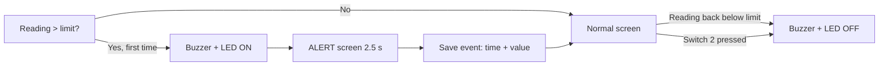
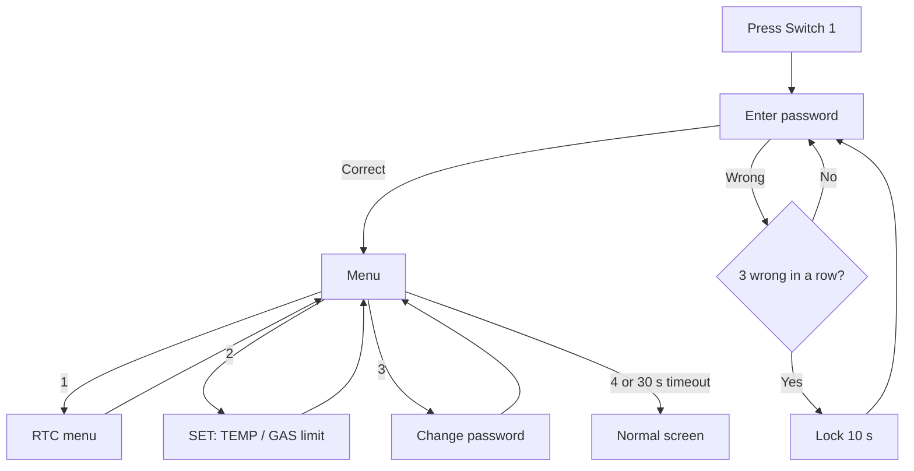
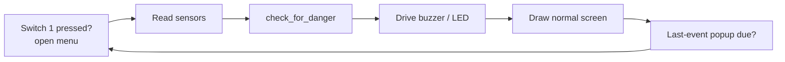

# Kitchen Safety – Heat and Gas Monitoring System

A password-protected kitchen safety monitor built on the **LPC2148 (ARM7)** microcontroller. It continuously measures **temperature** (LM35) and **gas level** (MQ-2), shows the live readings and the real-time clock on a 16x2 LCD, and raises a **buzzer + LED alarm** with an on-screen alert as soon as either reading crosses its limit.

Settings (clock, alarm limits, password) are protected by a keypad password and are edited from an on-screen menu.

-blue)


---

## Table of Contents

1. [What the project does](#1-what-the-project-does)
2. [Hardware required](#2-hardware-required)
3. [Pin connections](#3-pin-connections)
4. [Software required](#4-software-required)
5. [Project files](#5-project-files)
6. [Build and flash – step by step](#6-build-and-flash--step-by-step)
7. [How to use the system](#7-how-to-use-the-system)
8. [Changing the default settings](#8-changing-the-default-settings)
9. [How the code is organised](#9-how-the-code-is-organised)
10. [Troubleshooting](#10-troubleshooting)
11. [Known limitations and future work](#11-known-limitations-and-future-work)
12. [Author](#author)

---

## 1. What the project does

### Block diagram

<p align="center">
  
</p>

### Features

| Feature | Description |
|---|---|
| Live monitoring | Reads temperature and gas level continuously |
| Real-time clock | Shows time and date, kept running by the board's RTC battery |
| Alarm | Buzzer and LED turn ON when temperature or gas goes above its limit |
| Alert message | `ALERT!!` with `TEMP IS HIGH!` or `GAS IS HIGH!` is shown for 2.5 seconds when a limit is first crossed |
| Alarm mute | Switch 2 silences the buzzer and LED |
| Event history | The last alarm (time + value) pops up every 10 seconds for 3 seconds |
| Password protection | The settings menu opens only with the correct password |
| Auto-lock | 3 wrong passwords lock the system for 10 seconds |
| Settings menu | Change the clock, the temperature/gas limits and the password from the keypad |

### Default values

| Item | Default |
|---|---|
| Temperature limit | 40 °C |
| Gas limit | 300 (scale 0–1023) |
| Password | `1234` |
| Menu time-out | 30 seconds |

---

## 2. Hardware required

| # | Component | Purpose |
|---|---|---|
| 1 | LPC2148 ARM7 development board (Vector India *Advanced Development Board for ARM7*) | Main controller, on-board LCD, buzzer, LEDs, switches, RTC |
| 2 | 16x2 character LCD | Displays everything (on the board) |
| 3 | 4x4 matrix keypad | Enter the password and numbers |
| 4 | MQ-2 gas sensor module | Detects gas / smoke |
| 5 | LM35 temperature sensor | Measures temperature (10 mV per °C) |
| 6 | Buzzer | Audible alarm (on the board) |
| 7 | External 5 V / 3.3 V power supply board | Powers the sensors and the board |
| 8 | Jumper wires, small perfboard | Connections |

### Labeled photo of the setup

<p align="center">
  
</p>

### Setup with the keypad connected

The 4x4 keypad plugs into the board through the flat ribbon cable (marked **7** in the photo above). Its keys are laid out as:

```
1  2  3  A
4  5  6  B
7  8  9  C
*  0  #  D
```

<p align="center">
  
</p>

---

## 3. Pin connections

These pins come from the `#define` lines at the top of `src/main.c`.

| Function | LPC2148 pin | Notes |
|---|---|---|
| Buzzer | P0.28 (`BUZZER_PIN`) | Output |
| Alarm LED | P0.30 (`LED_PIN`) | Output |
| Switch 1 – open settings menu | P0.1 | Hardware interrupt (EINT0) |
| Switch 2 – mute alarm | P0.3 (`SWITCH2_PIN`) | Input, active-low (pressed = 0) |
| MQ-2 gas sensor | P0.29 (AIN2) | Analog input, ADC channel 2 |
| LM35 temperature sensor | ADC pin used by `LM35.c` | Analog input (write the exact pin/channel here) |
| LCD, keypad, RTC | On-board connections | Handled by `LCD.c`, `KPM.c`, `RTC.c` |

> **Important:** if you change a pin in the `#define` lines, change the physical wire as well. Never put two functions on the same pin.

---

## 4. Software required

| Tool | Use |
|---|---|
| **Keil µVision** (ARM/MDK) | Write, compile and build the project (the code uses the Keil `__irq` keyword and `<lpc21xx.h>`) |
| **Flash Magic** | Send the `.hex` file to the LPC2148 through the serial (UART) port |
| **USB-to-serial cable or the board's DB9 port** | Connection between PC and board for flashing |

---

## 5. Project files

```
kitchen-safety-system/
├── README.md              <- this file
├── src/
│   └── main.c             <- the main program
└── images/                <- photos used in this README
```

`main.c` also uses your lab's driver files. Keep them in the **same Keil project** as `main.c`:

| Header | Provides |
|---|---|
| `types.h` | `u32`, `s32`, `u8`, `f32` type names |
| `delay.h` | `delay_ms()` |
| `ADC.h`, `ADC_defines.h` | ADC setup and `Read_ADC()` |
| `LCD.h`, `LCD_defines.h` | LCD commands and printing (`StrLCD`, `U32LCD`, `S32LCD`, …) |
| `LM35.h` | `LM35tC()` – returns temperature in °C |
| `KPM.h` | Keypad functions (`Init_KPM`, `KeyScan`, `ColScan`) |
| `RTC.h` | RTC functions (`RTC_Init`, `GetRTCTimeInfo`, `SetRTCTimeInfo`, …) |

Copy the matching `.c` files of these drivers into the project folder too, and add them to the Keil project.

---

## 6. Build and flash – step by step

### Step 1 – Create the Keil project
1. Open Keil µVision → **Project → New µVision Project**.
2. Choose a folder, give it a name, and select the device **NXP → LPC2148**.
3. When asked to copy the *Startup file*, click **Yes**.

### Step 2 – Add the source files
1. Copy `main.c` and all driver `.c` / `.h` files into the project folder.
2. In the *Project* panel, right-click **Source Group 1 → Add Existing Files to Group** and add `main.c` plus every driver `.c` file.

### Step 3 – Set the clock and create the HEX file
1. **Project → Options for Target → Target**: set the crystal (Xtal) to **12 MHz**.
2. Open the **Output** tab and tick **Create HEX File**.
3. The code assumes a peripheral clock (PCLK) of **15 MHz** (`T0PR = 14999` gives a 1 ms timer tick). If your startup configuration uses a different PCLK, adjust this value.

### Step 4 – Build
Press **F7**. Fix any errors until you see `0 Error(s)`. A `.hex` file appears in the output folder.

### Step 5 – Flash the board
1. Connect the board to the PC with a serial cable and power it on.
2. Move the **ISP switch** to the *program* position and press **RST**.
3. Open **Flash Magic**, choose device **LPC2148**, the correct **COM port**, baud rate **9600** (or as your lab specifies), and select the `.hex` file.
4. Click **Start** and wait for *Finished*.
5. Move the ISP switch back to the *run* position and press **RST**.

The Vector ID and project title should now appear on the LCD.

---

## 7. How to use the system

### 7.1 Start-up
The LCD first shows the **Vector ID**, then the project title scrolling across the second line. After that the normal screen appears.

### 7.2 Normal screen

```
HH:MM:SS T:xx°C
DD/MM/YYYY S:x
```

- `T:` is the temperature in °C.
- `S:` is the gas status: **0 = safe**, **1 = gas above limit**.

| Gas safe (`S:0`) | Gas above limit (`S:1`) |
|:---:|:---:|
|  |  |

### 7.3 Alarm and alert

When temperature or gas **first goes above its limit**:

1. The buzzer and LED turn ON.
2. The LCD shows an alert for 2.5 seconds.
3. The LCD returns to the normal screen. The buzzer and LED stay ON until the reading falls back to the limit or below.

Press **Switch 2** to mute the buzzer and LED.

| Temperature alert | Gas alert |
|:---:|:---:|
|  |  |

**Last-event popup:** every 10 seconds, the last alarm event (time and value) is shown for 3 seconds. The buzzer stays silent during the popup.



### 7.4 Open the settings menu
1. Press **Switch 1**.
2. Type the password on the keypad (digits appear as `*`).
3. Press any non-digit key (for example `#`) to confirm. Press **C** to delete the last digit.

<p align="center">
  
</p>

| Wrong password | Three wrong tries |
|:---:|:---:|
| Shows *Access Denied* and beeps briefly. | The system locks for 10 seconds with a countdown, then asks for the password again. |
|  |  |

### 7.5 Settings menu

```
1.RTC 2.SET  30     <- number = seconds left to choose
3.PASS 4.EXIT
```

<p align="center">
  
</p>

The menu closes by itself after **30 seconds** without a key press.

| Key | Option | What it does |
|---|---|---|
| **1** | RTC | Set the clock and date (see below) |
| **2** | SET | `1.TEMP` – set the temperature limit (0–200 °C), `2.GAS` – set the gas limit (0–1023) |
| **3** | PASS | Change the password: enter the current password, then the new one, then confirm it |
| **4** | EXIT | Return to the normal screen |



### 7.6 RTC menu

| Key | Sets | Allowed range |
|---|---|---|
| 1 | Hour | 0 – 23 |
| 2 | Minute | 0 – 59 |
| 3 | Second | 0 – 59 |
| 4 | Date | 1 – 31 |
| 5 | Month | 1 – 12 |
| 6 | Year | 2000 – 2099 |
| 7 | Exit | Back to the previous menu |

Type the number and press a non-digit key (for example `#`) to save. Wrong values show *Invalid! Retry*.

<p align="center">
  
</p>

---

## 8. Changing the default settings

Open `src/main.c` and edit the `#define` lines at the top:

```c
#define TEMP_LIMIT        40     // alarm above this temperature (°C)
#define GAS_LIMIT         300    // alarm above this gas reading (0-1023)
#define DEFAULT_PASSWORD  1234   // starting password
#define MENU_WAIT_TIME    30000  // menu time-out in milliseconds
#define POPUP_EVERY       10000  // last-event popup interval (ms)
#define POPUP_FOR         3000   // last-event popup duration (ms)
```

Rebuild and flash again after any change. The alert duration is the `delay_ms(2500)` line inside `check_for_danger()`.

---

## 9. How the code is organised

`main.c` is split into numbered sections, so you can read it top to bottom:

| Section | Content |
|---|---|
| 1 | Settings (`#define`) |
| 2–3 | Event type and shared variables |
| 4 | 1 ms software clock using Timer 0 |
| 5 | Buzzer, LED and Switch 2 |
| 6 | Switch 1 interrupt (opens the menu) |
| 7–8 | Gas sensor and temperature display helper |
| 9 | Start-up splash screens |
| 10 | Saving and showing the last alarm event |
| 11 | `check_for_danger()` – compares readings with limits and shows the alert |
| 12 | Normal screen |
| 13 | Password, number entry, RTC, set-point and password menus, lock-out |
| 14 | `main()` – the main loop |

### Main loop



---

## 10. Troubleshooting

| Problem | Likely cause and fix |
|---|---|
| LCD is blank | Adjust the contrast potentiometer near the LCD; check the LCD data wires |
| Temperature always shows a wrong or very high value | Check the LM35 wiring (5 V, GND, output) and the ADC conversion in `LM35.c` |
| Gas alert always on | Let the MQ-2 warm up for a minute or two; adjust the sensor's on-board potentiometer or raise `GAS_LIMIT` |
| Keypad gives wrong keys | Check the ribbon cable orientation and the key table in `KPM.c` |
| Time resets to 00:00:00 after power-off | Check the RTC battery (coin cell on the board) |
| Cannot flash | Check COM port, baud rate and that the ISP switch is in program mode |
| Menu never opens | Check the Switch 1 wire on P0.1 and that the interrupt setup runs |
| Buzzer silent | Check the buzzer pin wire; make sure Switch 2 (mute) was not pressed |

---

## 11. Known limitations and future work

**Limitations**
- The password, temperature limit and gas limit are stored in RAM only. **They return to the defaults after a power cycle.**
- While the 2.5-second alert or a delay screen is showing, the sensors are not read.
- The keypad password is numeric only.

**Possible improvements**
- Store settings in flash/EEPROM
- Add SMS or app notifications
- Add a relay to switch off a gas valve

---

## Author

**Balaji Pidikiti**
